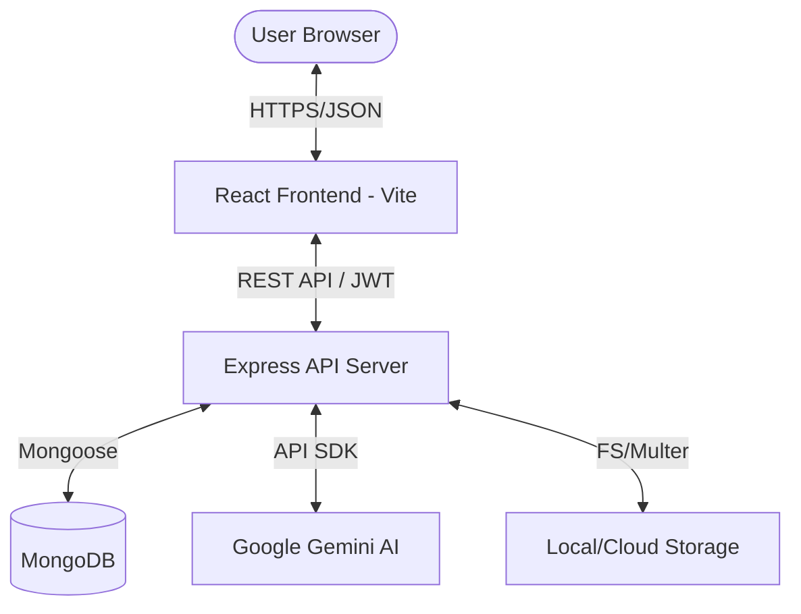
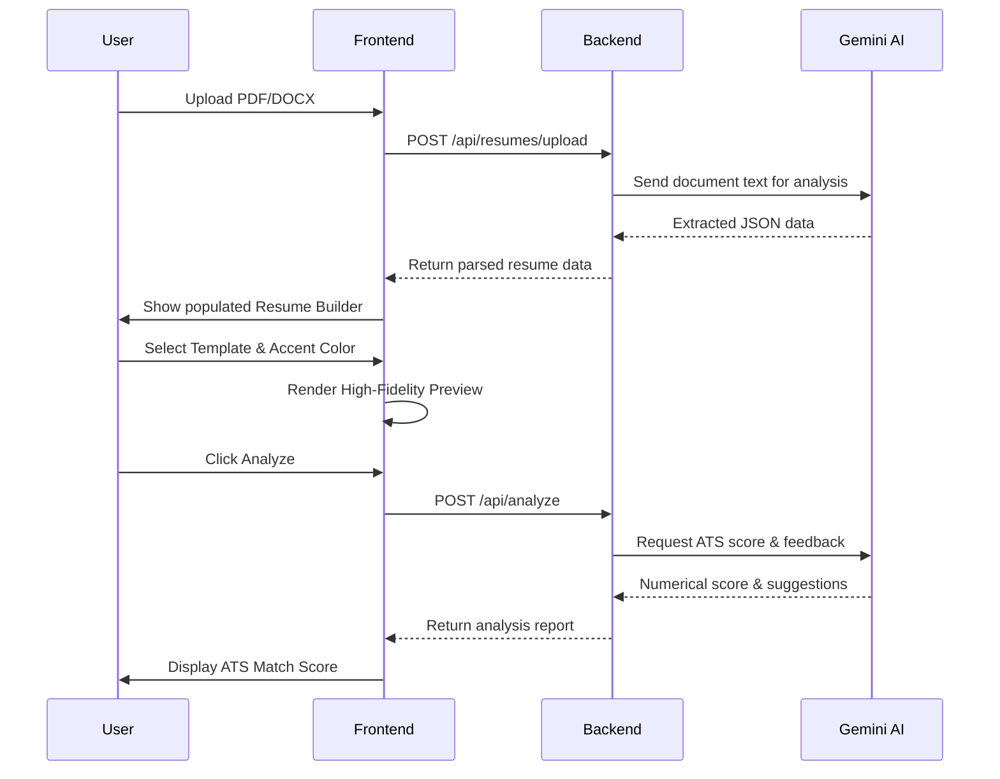

# Resume Builder

A professional, AI-powered resume building platform that allows users to create, manage, and analyze resumes with high-fidelity previews and intelligent feedback.

## System Architecture



## Application Flow



## Features

### Intelligent Parsing
- Automatic extraction of contact info, experience, and skills from uploaded documents.
- Powered by Google Gemini Pro for high-accuracy semantic understanding.

### High-Fidelity Previews
- Real-time rendering of resume templates.
- Dynamic color contrast adjustment based on accent color brightness.
- Live thumbnails on dashboard for quick recognition.

### Advanced Customization
- Multiple professional templates (Modern, Classic, Bento Box, etc.).
- Custom font sizes, heading sizes, and section spacing.
- Dark mode support with adaptive text rendering.

### AI Analysis
- In-depth ATS matching and scoring.
- Specific, actionable suggestions for improving resume content.
- Targeted analysis based on user-provided job descriptions.

## Technology Stack

### Frontend


- React 19 (Vite)
- Tailwind CSS 4
- React Router 7
- Google OAuth 2.0
- Lucide React Icons

### Backend


- Node.js & Express
- MongoDB & Mongoose
- Google Generative AI (Gemini API)
- JWT Authentication
- Multer for file processing

## Project Structure

```text
.
├── client/                 # React frontend application
│   ├── src/
│   │   ├── api/            # Axios instance and API calls
│   │   ├── assets/         # Templates and static assets
│   │   ├── components/     # UI Components (Builder, Dashboard, Home)
│   │   ├── context/        # Auth and Data contexts
│   │   └── pages/          # Main application views
├── server/                 # Express backend application
│   ├── config/             # Database and API configurations
│   ├── controllers/        # Request handling logic
│   ├── models/             # Mongoose schemas
│   ├── routes/             # API endpoints
│   └── uploads/            # Temporary storage for processed files
```

## Getting Started

### Prerequisites
- Node.js (v18+)
- MongoDB (Local or Atlas)
- Google Cloud Gemini API Key
- Google OAuth Client ID

### Installation

1. Clone the repository
2. Install dependencies for both client and server:
   ```bash
   # Root
   cd client && npm install
   cd ../server && npm install
   ```

3. Configure environment variables:
   - Create `client/.env`:
     ```text
     VITE_BACKEND=http://localhost:5000/api
     VITE_GOOGLE_CLIENT_ID=your_google_client_id
     ```
   - Create `server/.env`:
     ```text
     PORT=5000
     MONGODB_URI=your_mongodb_uri
     JWT_SECRET=your_secret
     GEMINI_API_KEY=your_gemini_key
     ```

4. Run the application:
   ```bash
   # In separate terminals
   cd client && npm run dev
   cd server && npm run dev
   ```

## Development Standards
- Maintain semantic HTML structure.
- Use the standard contrast utility for all template text colors.
- Follow the established adapter pattern for template data mapping.
